# End-to-End Employee Directory Migration to AWS

> **Migrating a Legacy Node.js Application from a Self-Managed MySQL Database on Amazon EC2 to Amazon RDS using AWS Database Migration Service (AWS DMS)**


---

# Project Overview

This project demonstrates an end-to-end cloud migration of a legacy Employee Directory web application from a self-managed MySQL database hosted on an Amazon EC2 instance (simulating an on-premises environment) to Amazon RDS for MySQL using AWS Database Migration Service (AWS DMS).

The project showcases the complete migration lifecycle, including infrastructure deployment, database migration, application cutover, validation, troubleshooting, and documentation while following AWS best practices.

---

# Business Scenario

A company hosts an internal Employee Directory application on a Linux server with a locally installed MySQL database.

As the organization grows, managing database backups, software updates, scalability, and high availability becomes increasingly difficult.

The objective is to modernize the application by migrating the database to Amazon RDS while minimizing downtime and ensuring application continuity.

---

# Technical Highlights

- Successfully migrated a self-managed MySQL database from Amazon EC2 to Amazon RDS.
- Configured and validated AWS Database Migration Service (AWS DMS).
- Performed successful application cutover with zero data loss.
- Diagnosed and resolved MySQL connectivity, networking, security group, and DMS endpoint issues.
- Updated the Node.js application to use Amazon RDS without requiring application code changes.
- Validated migration using SQL queries and application testing.
- Produced architecture documentation and implementation evidence through screenshots.

---

# Solution Architecture

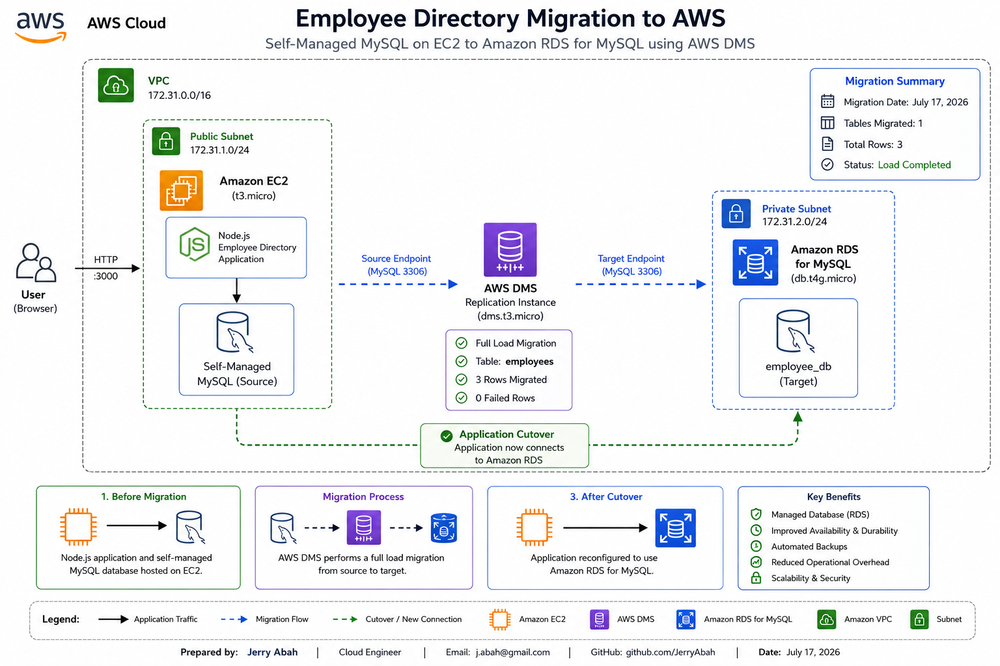

---

# AWS Services Used

| AWS Service | Purpose |
|--------------|---------|
| Amazon EC2 | Hosts the Node.js application and self-managed MySQL database |
| Amazon RDS for MySQL | Managed relational database replacing the self-managed database |
| AWS Database Migration Service (DMS) | Migrates the database from EC2 to Amazon RDS |
| Amazon VPC | Provides secure network isolation |
| Security Groups | Controls inbound and outbound network traffic |
| IAM | Grants AWS DMS the required permissions |

---

# Technology Stack

- Amazon EC2
- Amazon RDS (MySQL)
- AWS Database Migration Service (DMS)
- Node.js
- Express.js
- MySQL
- Linux (Ubuntu)
- Git
- GitHub

---

# Migration Workflow

1. Deploy the Employee Directory application on Amazon EC2.
2. Configure the self-managed MySQL database.
3. Create and populate the employee database.
4. Deploy Amazon RDS for MySQL.
5. Configure AWS DMS Replication Instance.
6. Create Source Endpoint.
7. Create Target Endpoint.
8. Perform Full Load migration.
9. Validate migrated data.
10. Update the application configuration.
11. Perform production-style application cutover.
12. Validate successful migration.

---

# Repository Structure

```text
employee-directory-aws-migration
│
├── docs
│   ├── architecture
│   │   └── 01-employee-directory-architecture.png
│   │
│   └── screenshots
│       ├── 02-ec2-instance.png
│       ├── 03-rds-instance.png
│       ├── 04-dms-endpoints.png
│       ├── 05-dms-task-overview.png
│       ├── 06-dms-table-statistics.png
│       ├── 07-premigration-assessment.png
│       ├── 08-rds-data-validation.png
│       ├── 09-application-after-cutover.png
│       ├── 10-node-connected-to-rds.png
│       ├── 11-security-group-ec2.png
│       └── 12-security-group-rds.png
│
├── public
├── sql
├── db.js
├── server.js
├── package.json
├── package-lock.json
├── README.md
└── .env.example
```

---

# Migration Results

| Metric | Result |
|---------|--------|
| Migration Type | Full Load |
| Tables Migrated | 1 |
| Records Migrated | 3 |
| Failed Records | 0 |
| Application Cutover | Successful |
| Data Validation | Successful |

---

# Implementation Screenshots

## Amazon EC2 Instance

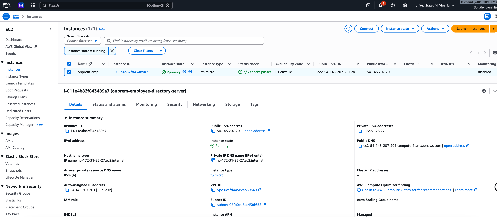

---

## Amazon RDS Instance

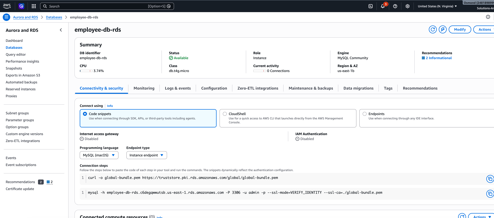

---

## AWS DMS Endpoints

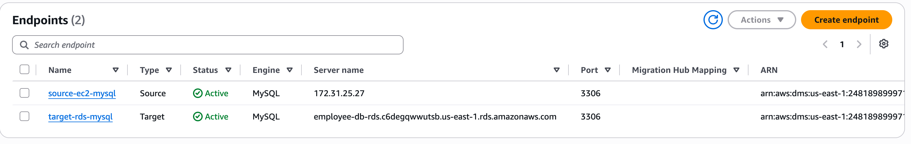

---

## AWS DMS Migration Task

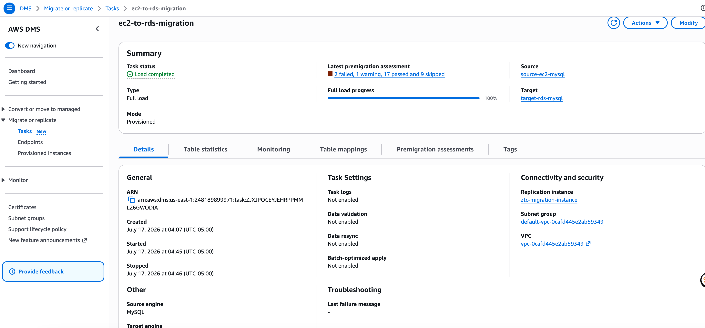

---

## Table Migration Statistics

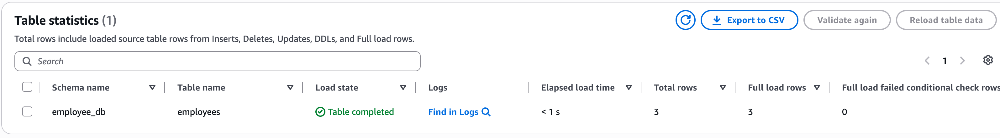

---

## Pre-Migration Assessment

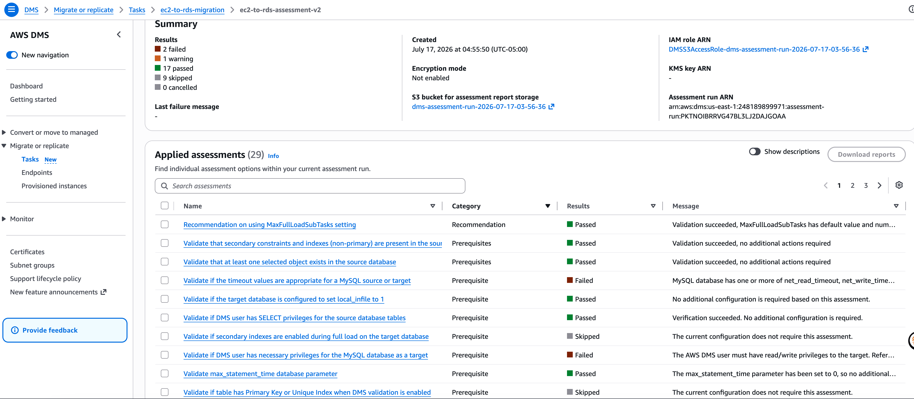

---

## Amazon RDS Data Validation

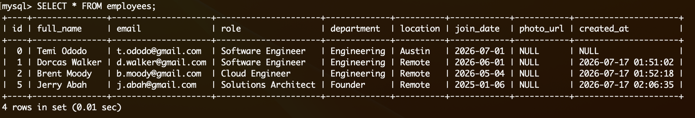

---

## Application After Database Cutover

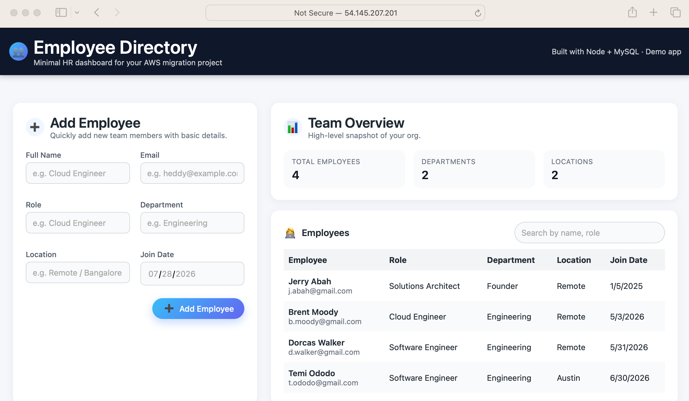

---

## Node.js Application Connected to Amazon RDS

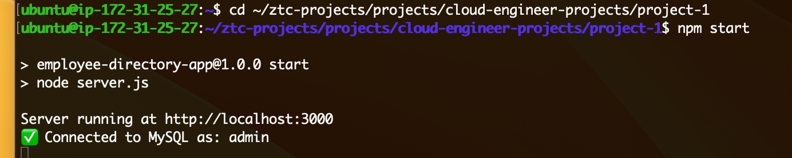

---

## Amazon EC2 Security Group

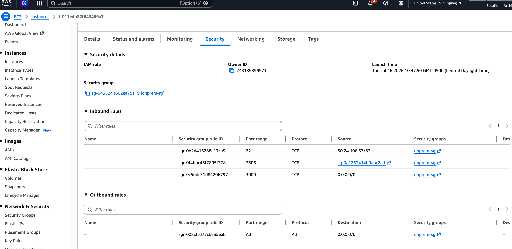

---

## Amazon RDS Security Group

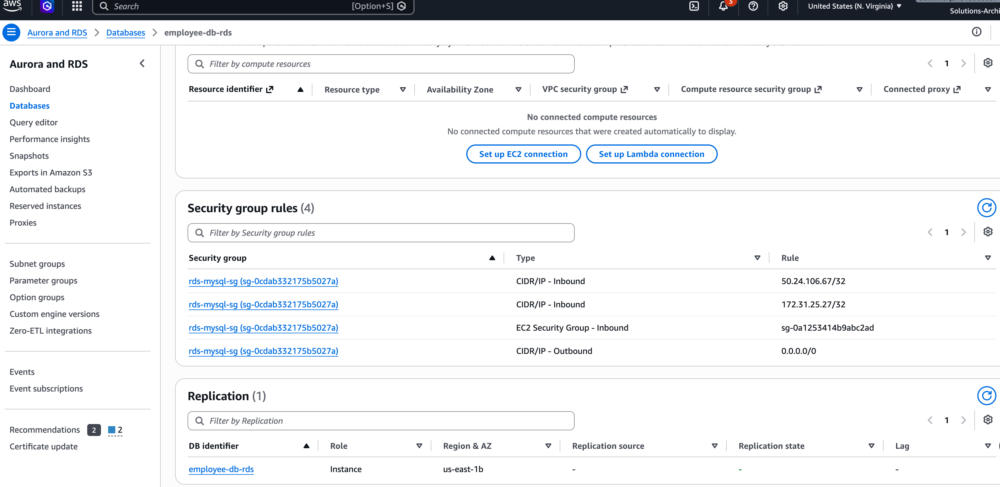

---

# Challenges Encountered

During the migration, several real-world cloud engineering challenges were encountered and successfully resolved.

- Configured MySQL for remote access by updating the bind address.
- Resolved AWS DMS endpoint connectivity failures.
- Corrected MySQL user privileges required by AWS DMS.
- Configured Security Groups to allow database communication.
- Investigated and resolved DMS pre-migration assessment failures.
- Updated application environment variables for Amazon RDS connectivity.
- Validated successful migration through SQL queries and application testing.

These troubleshooting activities closely mirror challenges commonly encountered during production cloud migration projects.

---

# Skills Demonstrated

## AWS

- Amazon EC2
- Amazon RDS
- AWS Database Migration Service (AWS DMS)
- VPC Networking
- Security Groups
- IAM

## Cloud Engineering

- Cloud Migration
- Infrastructure Deployment
- Database Modernization
- Networking
- Troubleshooting
- Application Cutover

## Linux

- SSH
- Ubuntu Administration
- Package Management
- Environment Variables

## Databases

- MySQL
- SQL
- Database Migration
- User Privileges

## Development

- Node.js
- Express.js
- Git
- GitHub

---

# Lessons Learned

This project reinforced several important cloud engineering concepts:

- Benefits of managed database services.
- Cloud migration planning and execution.
- Database connectivity troubleshooting.
- AWS networking fundamentals.
- Security best practices.
- Migration validation techniques.
- Importance of post-migration testing.
- Structured troubleshooting using AWS services and Linux tools.

---

# Future Enhancements

Potential improvements include:

- Multi-AZ Amazon RDS deployment
- AWS Secrets Manager integration
- SSL/TLS encrypted database connections
- Automated backups
- CloudWatch monitoring and alarms
- Infrastructure as Code using Terraform
- CI/CD pipeline with GitHub Actions
- High Availability architecture with Auto Scaling

---

# Key Takeaways

This project demonstrates practical experience with cloud migration and AWS infrastructure by successfully:

- Migrating a production-style application database.
- Troubleshooting networking and database connectivity issues.
- Implementing AWS Database Migration Service.
- Performing application cutover.
- Validating migrated data.
- Documenting the complete migration process using architecture diagrams and implementation evidence.

---

# Author

**Jeremiah Abah**

Cloud Security Engineer | AWS Certified Solutions Architect – Associate | Adjunct Cybersecurity Faculty | Ph.D. Student (Cyber Engineering)

## Connect

- **GitHub:** https://github.com/Jerryabah
- **LinkedIn:** https://www.linkedin.com/in/jeremiah-abah/

---

> **Note:** This project was completed as part of hands-on AWS Cloud Engineering training and demonstrates practical experience in cloud migration, database modernization, AWS infrastructure deployment, Linux administration, and production-style troubleshooting.